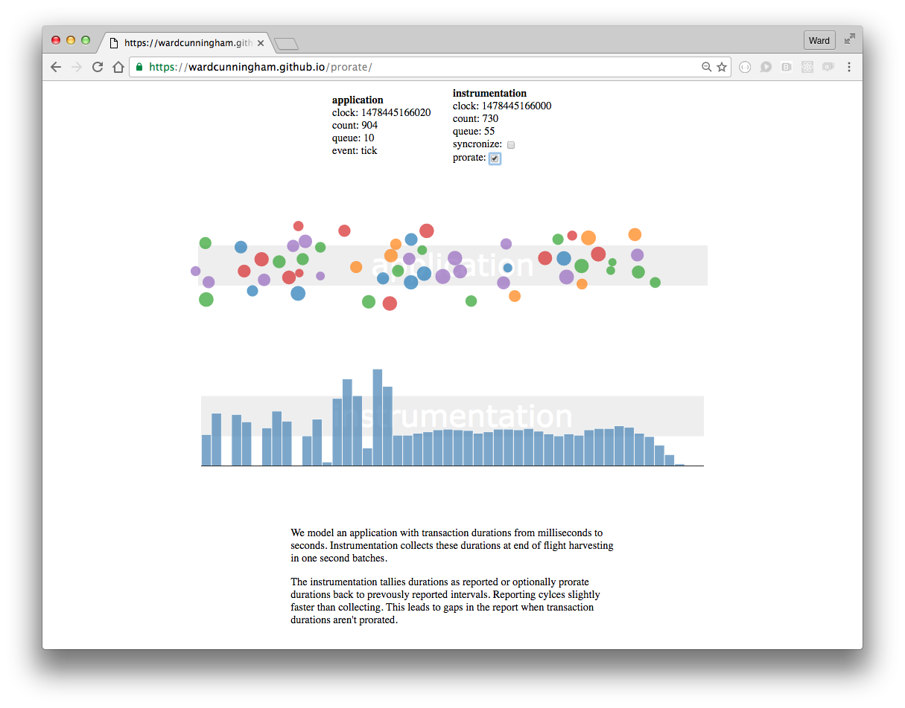

prorate
=======

model application traffic and visualize it two related ways



We model an application with transaction durations from milliseconds to seconds. Instrumentation collects these durations at end of flight and reports them in one second batches.

The instrumentation can tally durations as reported or optionally prorate durations back to prevously reported intervals. Reporting cylces slightly faster than collecting. This leads to gaps in the report when transaction durations aren't prorated.


install
=======
```
git clone ...
npm install
```
run
===
```
webserver 3090
```
